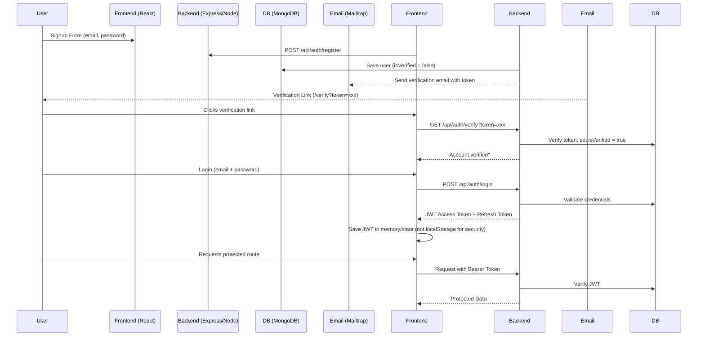

# Advanced MERN Authentication System

**A comprehensive authentication project built using the MERN stack to implement secure user registration, email verification, password recovery, and welcome emails.**

---

##  Demo  
Live version: 

---

##  Features

- User **signup** with email validation  
- **Login / Logout** flows  
- **Email Verification** to ensure user authenticity  
- **Password Recovery** system with email-based reset links  
- **Welcome Email** sent upon successful signup  
- **JWT-based** authentication, with **bcrypt** password hashing  
- Secure **frontend** routes and protected dashboards  
- Clean and user-friendly interface built with **React** (state managed via Zustand)

---

##  Tech Stack

- **Frontend:** React.js, optional state management with Zustand  
- **Backend:** Node.js, Express.js  
- **Database:** MongoDB  
- **Authentication:** JWT for issuing and verifying tokens, bcrypt for hashing passwords  
- **Email Service:** Mailtrap for email sending, verification, password reset, welcome emails

---

##  Architecture & System Flow

```plaintext
[User] → (1) Signup form → [Frontend: React]
   → (2) POST /api/auth/register → [Backend: Express/Node + MongoDB]
      • Creates user (with `isVerified = false`)
      • Generates an email verification token (JWT or DB stored token)
      • Sends verification email via Mailtrap with a link: `/verify?token=...`
→ (3) User clicks verification link → GET /api/auth/verify → Backend verifies token, activates account
→ (4) Login: POST /api/auth/login → Backend confirms credentials → returns JWT access token
→ (5) Protected routes require the JWT (Auth middleware)
→ (6) Password recovery: POST /api/auth/forgot → Backend generates reset token → Email reset link `/reset?token=...`
→ (7) User clicks reset link → POST /api/auth/reset → Backend validates token and updates password
→ (8) On successful signup, send Welcome email via Mailtrap
```


## Token Flow Diagram




